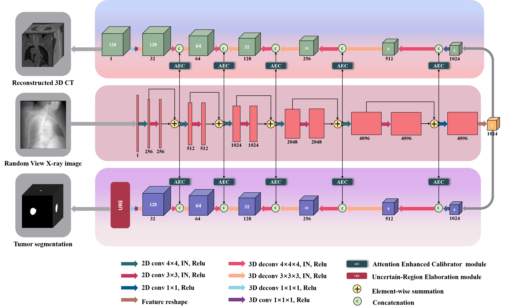
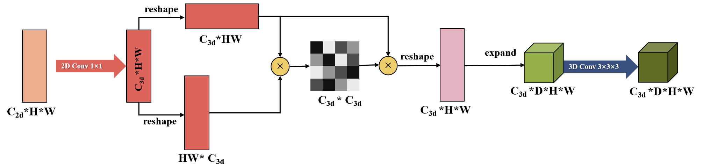
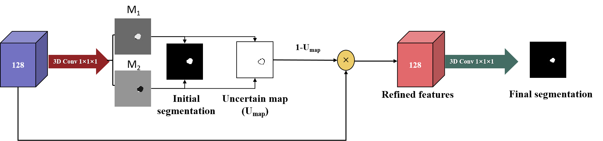
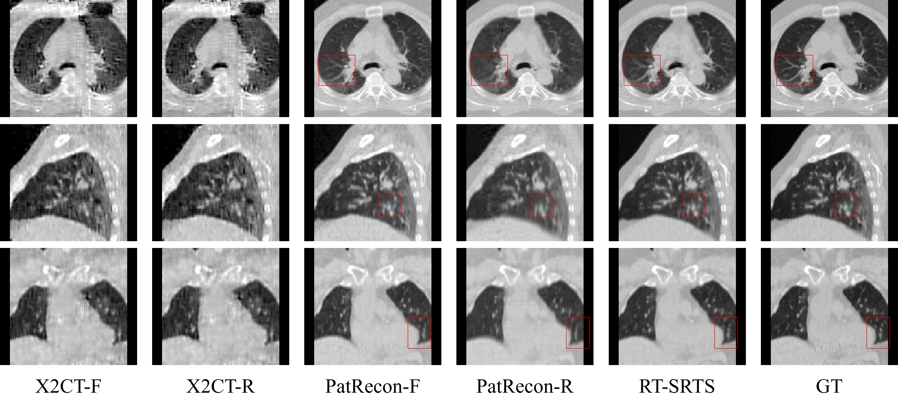
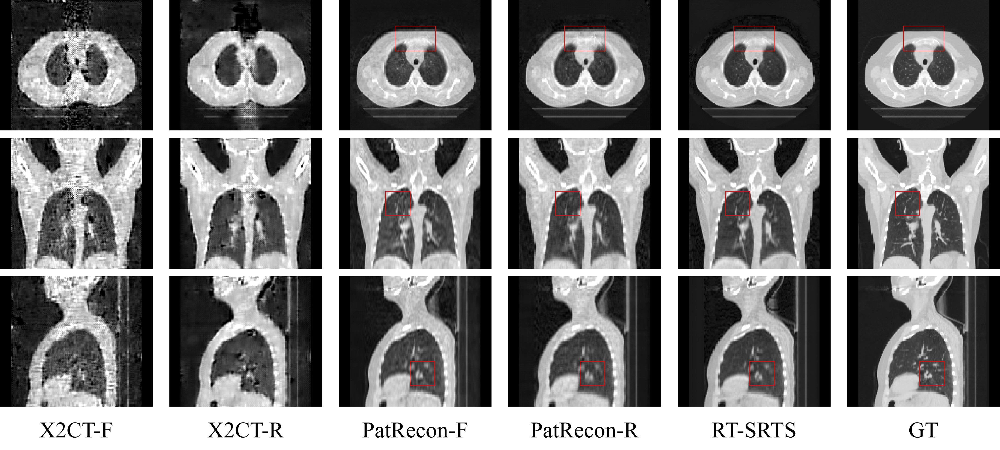

# RT-SRTS
This is the code repository for RT-SRTS.

The Reconstruction Toolkit (RTK) is an open source cross-platform software for rapid cone beam CT reconstruction based on the Insight Toolkit (ITK). RTK is an open source package of CBCT reconstruction algorithms, owned by Kitware, and is based on the ITK package extension. RTK implements many existing CT image reconstruction algorithms, including ADMM, SART, SIRT, POCS, etc.

We use RTK to obtain DRR images from CT images at a certain angle. If you can't properly use the RTK, I recommend that you look through the RTK official website.[RTK - Reconstruction Toolkit (openrtk.org)](https://www.openrtk.org/)

## ✏️ Introduction
Our network is structured as follows.
For more details, please read the paper.


The AEC module is shown below.


The URE module is shown below.



## ⚙️ Install
```sh
$ git clone https://github.com/ZywooSimple/RT-SRTS.git
$ cd RT-SRTS
$ conda env create -f environment.yaml
$ conda activate RT-SRTS
```

## 💾 Data
The geometry file is used for the RTK to generate DRR image at a certain angle.

We saved each real 3DCT and corresponding real tumor label into the h5py file and put it into a separate folder according to the 1080 time phase. The structure is as follows:
```sh
|--h5py
|  |--1
|   |--ct_xray12_label.h5
|  |--2
|    |--ct_xray12_label.h5
   ·········
|--ct_rtk
|  |--1_rtk.mha
|  |--2_rtk.mha
|  |--3_rtk.mha
   ·········
```
The reason why we create subfiles under h5py instead of listing all files directly: the generated DRR image will be saved under this path.

We give an instance in the "example" floder.


## ⏳Train & Test
To train our model, run:
```python 
$ python RT-SRTS/train.py
```
For the details in ".py" file：the “--exp” represents patient case name, “--date” represents the model name, "--experiment_path" represents the output root directory, 
To test our model, run :
```python 
$ python RT-SRTS/test.py
```

## 📊 Result




## Contact
If you have any questions, please feel free to contact <bo.liu@buaa.edu.cn>.

## Acknowledgement
Our code is based on the implementation of PatRecon. We thank PatRecon's authors for their work and repository.
